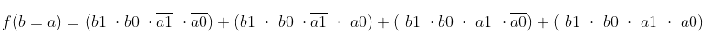

# Digital-electronics-1

# Lab 02-logic

## 1.Preparation tasks

### Binary comparator truth table:

| **Dec. equivalent** | **B[1:0]** | **A[1:0]** | **B is greater than A** | **B equals A** | **B is less than A** |
| :-:                 | :-:        | :-:        | :-:                     | :-:            | :-:                  |
| 0                   | 0 0        | 0 0        | 0                       | 1              | 0                    | 
| 1                   | 0 0        | 0 1        | 0                       | 0              | 1                    |
| 2                   | 0 0        | 1 0        | 0                       | 0              | 1                    |
| 3                   | 0 0        | 1 1        | 0                       | 0              | 1                    |
| 4                   | 0 1        | 0 0    	| 1 			  | 0 		   | 0			  |
| 5                   | 0 1        | 0 1 	| 0 			  | 1 		   | 0			  |
| 6                   | 0 1        | 1 0   	| 0 			  | 0		   | 1			  |
| 7                   | 0 1        | 1 1   	| 0 			  | 0 		   | 1 			  |
| 8                   | 0 0        | 0 0   	| 1 			  | 0 		   | 0			  |
| 9                   | 1 0 	   | 0 1   	| 1			  | 0		   | 0			  |
| 10                  | 1 0        | 1 0  	| 0 			  | 1		   | 0 			  |
| 11                  | 1 0        | 1 1  	| 0			  | 0 		   | 1			  |
| 12                  | 1 1        | 0 0   	| 1			  | 0		   | 0			  |
| 13                  | 1 1        | 0 1   	| 1			  | 0		   | 0 			  |
| 14                  | 1 1 	   | 1 0 	| 1 			  | 0 		   | 0 			  |
| 15                  | 1 1 	   | 1 1 	| 0 			  | 1 		   | 0 			  |


## 2.A 2-bit comparator

### Karnaugh maps for all three functions:





### Simplified SoP form of the function and simplified PoS form of the function:


## 3.A 4-bit binary comparator

### Listing of VHDL code (design.vhd):
```vhdl
library ieee;
use ieee.std_logic_1164.all;

entity comparator_4bit is
    port(
        a_i           : in  std_logic_vector(4 - 1 downto 0);
        b_i           : in  std_logic_vector(4 - 1 downto 0);

        B_greater_A_o	: out	std_logic;
        B_equals_A_o	: out	std_logic;
	B_less_A_o	: out	std_logic	
        );
end entity comparator_4bit;

architecture Behavioral of comparator_4bit is
begin
    
    B_greater_A_o	<= '1' when (b_i > a_i) else '0';
    B_equals_A_o	<= '1' when (b_i = a_i) else '0';
    B_less_A_o          <= '1' when (b_i < a_i) else '0';

end architecture Behavioral;
```

### Listing of VHDL testbench (testbench.vhd):
```vhdl
library ieee;
use ieee.std_logic_1164.all;

entity tb_comparator_4bit is
end entity tb_comparator_4bit;

architecture testbench of tb_comparator_4bit is

    signal s_a           : std_logic_vector(4 - 1 downto 0);
    signal s_b           : std_logic_vector(4 - 1 downto 0);
    signal s_B_greater_A : std_logic;
    signal s_B_equals_A  : std_logic;
    signal s_B_less_A    : std_logic;

begin
    uut_comparator_4bit : entity work.comparator_4bit
        port map(
            a_i           => s_a,
            b_i           => s_b,
            B_greater_A_o => s_B_greater_A,
            B_equals_A_o  => s_B_equals_A,
            B_less_A_o    => s_B_less_A
        );

    p_stimulus : process
    begin
        report "Stimulus process started" severity note;

        s_b <= "0000"; s_a <= "0000"; wait for 100 ns;
        assert ((s_B_greater_A = '0') and (s_B_equals_A = '1') and (s_B_less_A = '0'))
        report "Test failed for input combination: 0000, 0000" severity error;
   
        s_b <= "0000"; s_a <= "0001"; wait for 100 ns;
        assert ((s_B_greater_A = '0') and (s_B_equals_A = '0') and (s_B_less_A = '1'))
        report "Test failed for input combination: 0000, 0001" severity error;

        s_b <= "0000"; s_a <= "0010"; wait for 100 ns;
        assert ((s_B_greater_A = '0') and (s_B_equals_A = '0') and (s_B_less_A = '1'))
        report "Test failed for input combination: 0000, 0010" severity error;

        s_b <= "0000"; s_a <= "0011"; wait for 100 ns;
        assert ((s_B_greater_A = '0') and (s_B_equals_A = '0') and (s_B_less_A = '1'))
        report "Test failed for input combination: 0000, 0011" severity error;

        s_b <= "0000"; s_a <= "0100"; wait for 100 ns;
        assert ((s_B_greater_A = '0') and (s_B_equals_A = '0') and (s_B_less_A = '1'))
        report "Test failed for input combination: 0000, 0100" severity error;

        s_b <= "0000"; s_a <= "0101"; wait for 100 ns;
        assert ((s_B_greater_A = '0') and (s_B_equals_A = '0') and (s_B_less_A = '1'))
        report "Test failed for input combination: 0000, 0101" severity error;

        s_b <= "0000"; s_a <= "0110"; wait for 100 ns;
        assert ((s_B_greater_A = '0') and (s_B_equals_A = '0') and (s_B_less_A = '1'))
        report "Test failed for input combination: 0000, 0110" severity error;
 
        s_b <= "0000"; s_a <= "0111"; wait for 100 ns;
        assert ((s_B_greater_A = '0') and (s_B_equals_A = '0') and (s_B_less_A = '1'))
        report "Test failed for input combination: 0000, 0111" severity error;

        s_b <= "0000"; s_a <= "1000"; wait for 100 ns;
        assert ((s_B_greater_A = '0') and (s_B_equals_A = '0') and (s_B_less_A = '1'))
        report "Test failed for input combination: 0000, 1000" severity error;

        s_b <= "0000"; s_a <= "1001"; wait for 100 ns;
        assert ((s_B_greater_A = '0') and (s_B_equals_A = '1') and (s_B_less_A = '0'))
        report "Test failed for input combination: 0000, 1001" severity error;

        report "Stimulus process finished" severity note;
        wait;
    end process p_stimulus;

end architecture testbench;
```

### Listing of simulator console output:


### Link to EDA Playground:
https://www.edaplayground.com/x/MPiz