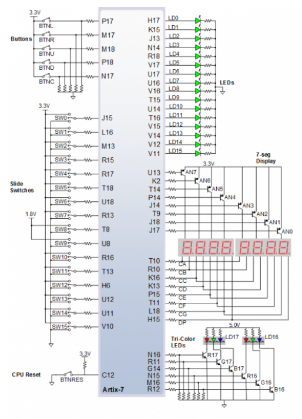
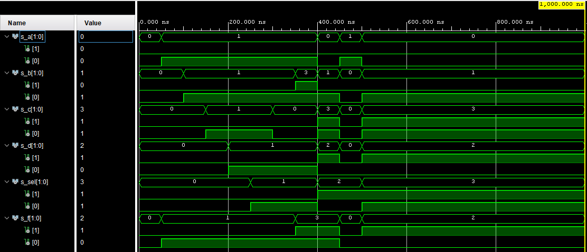

# Digital-electronics-1

# Lab 03-vivado

## 1.Preparation tasks

### 16 slide switches and 16 LEDs Nexys A7 board:

|  LED  | Connection | Switch | Connection | 
|  :-:  |     :-:    |   :-:  |     :-:    |
| LED0  |     H17    |   SW0  |     J15    |
| LED1  |     K15    |   SW1  |     L16    |
| LED2  |     J13    |   SW2  |     M13    |
| LED3  |     N14    |   SW3  |     R15    |
| LED4  |     R18    |   SW4  |     R17    |
| LED5  |     V17    |   SW5  |     T18    |
| LED6  |     U17    |   SW6  |     U18    |
| LED7  |     U16    |   SW7  |     R13    |
| LED8  |     V16    |   SW8  |     T8     |
| LED9  |     T15    |   SW9  |     U8     |
| LED10 |     U14    |   SW10 |     R16    |
| LED11 |     T16    |   SW11 |     T13    |
| LED12 |     V15    |   SW12 |     H6     |
| LED13 |     V14    |   SW13 |     U12    |
| LED14 |     V12    |   SW14 |     U11    |
| LED15 |     V11    |   SW15 |     V10    |




## 2.Two-bit wide 4-to-1 multiplexer

### VHDL architecture:
```vhdl
library ieee;
use ieee.std_logic_1164.all;

entity mux_2bit_4to1 is
    port(
    a_i           : in  std_logic_vector(2 - 1 downto 0);
    b_i           : in  std_logic_vector(2 - 1 downto 0);
    c_i           : in  std_logic_vector(2 - 1 downto 0);
    d_i           : in  std_logic_vector(2 - 1 downto 0);
    sel_i         : in  std_logic_vector(2 - 1 downto 0);
    f_o	      : out  std_logic_vector(2 - 1 downto 0)
        );

end entity mux_2bit_4to1;

architecture Behavioral of mux_2bit_4to1 is
begin
    
        f_o     <=    a_i   when (sel_i = "00") else
	b_i                 when (sel_i = "01") else
	c_i                 when (sel_i = "10") else
	d_i;

end architecture Behavioral;
```

### VHDL stimulus process:
```vhdl
library ieee;
use ieee.std_logic_1164.all;

entity tb_mux_2bit_4to1 is
    -- Entity of testbench is always empty
end entity tb_mux_2bit_4to1;

architecture testbench of tb_mux_2bit_4to1  is

    signal s_a         : std_logic_vector(2 - 1 downto 0);
    signal s_b         : std_logic_vector(2 - 1 downto 0);
    signal s_c         : std_logic_vector(2 - 1 downto 0);
    signal s_d         : std_logic_vector(2 - 1 downto 0);
    signal s_sel       : std_logic_vector(2 - 1 downto 0);
    signal s_f         : std_logic_vector(2 - 1 downto 0);

begin
    uut_mux_2bit_4to1 : entity work.mux_2bit_4to1
        port map(
            a_i           => s_a,
            b_i           => s_b,
            c_i           => s_c,
            d_i           => s_d,
            sel_i         => s_sel,
            f_o           => s_f
        );

    p_stimulus : process
    begin
        report "Stimulus process started" severity note;  
        
        s_d <= "00"; s_c <= "00";  s_b <= "00"; s_a <= "00";
        s_sel <= "00"; wait for 50 ns;

        s_a <= "01"; wait for 50 ns;
	s_b <= "01"; wait for 50 ns;
	    
	s_c <= "01"; wait for 50 ns;
	s_d <= "01"; wait for 50 ns;
	
	s_sel <= "01"; wait for 50 ns;
	s_c <= "00"; wait for 50 ns;
	s_b <= "11"; wait for 50 ns;
	
	s_d <= "10"; s_c <= "11"; s_b <= "01"; s_a <= "00";	 
	s_sel <= "10"; wait for 50 ns;
	
	s_d <= "00"; s_c <= "00"; s_b <= "00"; s_a <= "01";
	s_sel <= "10"; wait for 50 ns;

	s_d <= "10"; s_c <= "11"; s_b <= "01"; s_a <= "00";
	s_sel <= "11"; wait for 50 ns;
	
        report "Stimulus process finished" severity note;
        wait;
    end process p_stimulus;

end architecture testbench;
```

### Screenshot with simulated time waveforms:



## A Vivado tutorial

### Create project:
1) Otvoríme aplikáciu Vivado 2020.2
2) Create Project
3) Klikneme na "Next >"
4) Napíšeme názov projektu, vyberieme si miesto uloženia a klikneme na "Next>"
5) Necháme zakliknute _RTL Project a klikneme na "Next >"

### Adding Source:
1) Klikneme na "Create File", file type nastavíme na "VHDL" a napíšeme názov
2) Klikneme na "OK" a "Next >"
3) Ďalej klikneme na "Next >"
4) Klikneme na "Boards" a vyberieme si dosku, napr. "Nexys A7-50T"
5) Klikneme na "Next >" a následne na "Finish"
6) Klikneme na "OK" a "Yes"

### Adding testbench
1) Otvoríme si zložku "Simulation Sources"
2) Kliknutím na zložku "sim_1" a na "Add Sources..."
3) Klikneme na "Next >"
4) Klikneme na "Create simulation sources" a následne na "Create File"
5) File type si zvolíme "VHDL" a napíšeme názov ktorý bude začínať "tb_" 
6) Klikneme na "OK" a na "Finish"
7) Klikneme "OK" a "Yes"

### Running simulation
1) Pod "Simulation" klikneme na "Run Simulation" a na "Run Behavioral Simulation"
2) Po chvíli sa nám v novom okne otvoria naše grafy