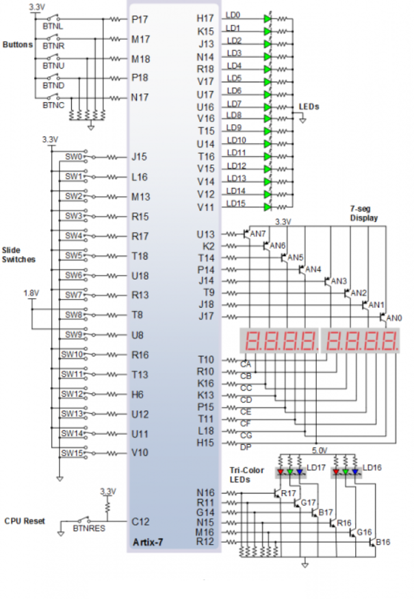

# Digital-electronics-1

# Lab 05-counter

## 1.Preparation tasks

### Figure or table with connection of push buttons on Nexys A7 board



| Button | Pin | 
| :-:    | :-: | 
| BTNL   | P17 | 
| BTNR   | M17 |
| BTNU   | M18 | 
| BTND   | P18 | 
| BTNC   | N17 | 
| BTNRES | C12 |

### Table with calculated values

| Time interval | Number of clk periods | Number of clk periods in hex | Number of clk periods in binary |
   | :-: | :-: | :-: | :-: |
   | 2 ms | 200 000 | x"3_0d40" | b"0011_0000_1101_0100_0000" |
   | 4 ms | 400 000 | x"6_1a80" | b"0110 0001 1010 1000 0000" |
   | 10 ms |1 000 000| x"f_4240" | b"1111 0100 0010 0100 0000" |
   | 250 ms |25 000 000| x"17D_7840" | b"0001 0111 1101 0111 1000 0100 0000" |
   | 500 ms |50 000 000| x"2FA_F080" | b"0010 1111 1010 1111 0000 1000 0000" |
   | 1 sec | 100 000 000 | x"5F5_E100" | b"0101_1111_0101_1110_0001_0000_0000" |

## 2.Bidirectional counter

### Listing of VHDL code of the process ```p_cnt_up_down``` with syntax highlighting:
```vhdl

```

### Listing of VHDL reset and stimulus processes from testbench file ```tb_cnt_up_down.vhd``` with syntax highlighting and asserts:
```vhdl

```

### Screenshot with simulated time waveforms:


### VHDL code from source file ```top.vhd```:
```vhdl

```

## 3.Top level

### Listing of VHDL code from source file ```top.vhd``` with all instantiations for the 4-bit bidirectional counter:

```vhdl

```

### Image of the top layer including both counters, ie a 4-bit bidirectional counter from Part 4 and a 16-bit counter with a different time base:

