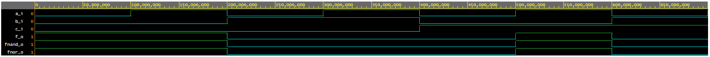
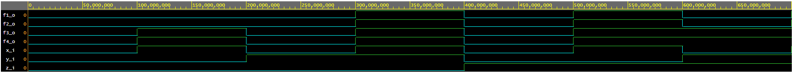

# Digital-electronics-1

# Lab 01-gates

https://github.com/xburco00/Digital-electronics-1

## De Morgan's laws of function f(c,b,a) simulation

### VHDL code design.vhd
```vhdl
library ieee;               
use ieee.std_logic_1164.all;

entity gates is
    port(
        a_i    : in  std_logic;         
        b_i    : in  std_logic;
        c_i    : in  std_logic;        
        f_o  : out std_logic;         
        fnand_o : out std_logic;         
        fnor_o : out std_logic          
    );
end entity gates;

architecture dataflow of gates is
begin
    f_o  <= ((not b_i) and a_i) or ((not c_i) and (not b_i));
    fnand_o <= ((b_i nand b_i) nand (a_i)) nand ((c_i nand c_i) nand (b_i nand b_i));
    fnor_o <= not(((b_i) nor (a_i nor a_i)) nor(c_i nor b_i));

end architecture dataflow;
```

### Graph


### EDA playground link
https://www.edaplayground.com/x/WEEz

### Table
| c | b | a |f(c,b,a)|
|:-:|:-:|:-:|   :-:  |
| 0 | 0 | 0 |    1   |
| 0 | 0 | 1 |    1   |
| 0 | 1 | 0 |    0   |
| 0 | 1 | 1 |    0   |
| 1 | 0 | 0 |    0   |
| 1 | 0 | 1 |    1   |
| 1 | 1 | 0 |    0   |
| 1 | 1 | 1 |    0   |


## Verification of Distributive laws

### VHDL code design.vhd
```vhdl
library ieee;               
use ieee.std_logic_1164.all;

entity gates is
    port(
        x_i    : in  std_logic;
        y_i    : in  std_logic;
        z_i    : in  std_logic;
        f1_o   : out std_logic;
        f2_o   : out std_logic;
        f3_o   : out std_logic;         
        f4_o   : out std_logic          
    );
end entity gates;

architecture dataflow of gates is
begin
    f1_o <= (x_i and y_i) or (x_i and z_i);
    f2_o <= x_i and (y_i or z_i);
    f3_o <= (x_i or y_i) and (x_i or z_i);
    f4_o <= x_i or (y_i and z_i);

end architecture dataflow;
```

### Graph


### EDA playground link
https://www.edaplayground.com/x/8MWp
