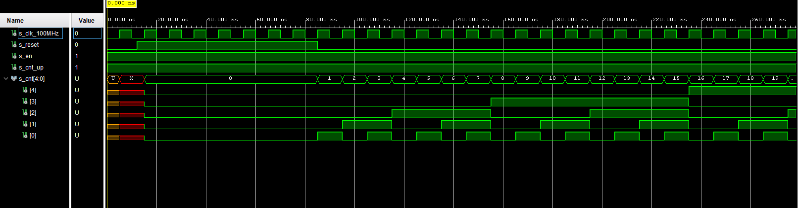
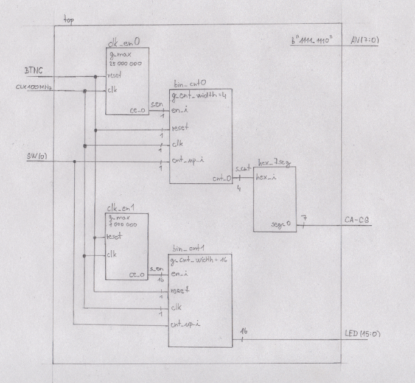

# Digital-electronics-1

# Lab 05-counter

## 1.Preparation tasks

### Figure or table with connection of push buttons on Nexys A7 board


| Button | Pin | 
| :-:    | :-: | 
| BTNL   | P17 | 
| BTNR   | M17 |
| BTNU   | M18 | 
| BTND   | P18 | 
| BTNC   | N17 | 
| BTNRES | C12 |

### Table with calculated values

| Time interval | Number of clk periods | Number of clk periods in hex | Number of clk periods in binary |
| :-: | :-: | :-: | :-: |
| 2 ms | 200 000 | x"3_0d40" | b"0011_0000_1101_0100_0000" |
| 4 ms | 400 000 | x"6_1a80" | b"0110_0001_1010_1000_0000" |
| 10 ms |1 000 000| x"f_4240" | b"1111_0100_0010_0100_0000" |
| 250 ms |25 000 000| x"17d_7840" | b"0001_0111_1101_0111_1000_0100_0000" |
| 500 ms |50 000 000| x"2fa_f080" | b"0010_1111_1010_1111_0000_1000_0000" |
| 1 sec | 100 000 000 | x"5f5_e100" | b"0101_1111_0101_1110_0001_0000_0000" |

## 2.Bidirectional counter

### Listing of VHDL code of the process ```p_cnt_up_down```:
```vhdl
p_cnt_up_down : process(clk)
    begin
        if rising_edge(clk) then
        
            if (reset = '1') then               -- Synchronous reset
                s_cnt_local <= (others => '0'); -- Clear all bits

            elsif (en_i = '1') then       -- Test if counter is enabled

            
            if (cnt_up_i = '1') then              
                s_cnt_local <= s_cnt_local + 1;
                
           else              
                s_cnt_local <= s_cnt_local - 1;
           
           end if;

           end if;
        end if;
    end process p_cnt_up_down;

    -- Output must be retyped from "unsigned" to "std_logic_vector"
    cnt_o <= std_logic_vector(s_cnt_local);
```

### Listing of VHDL reset and stimulus processes from testbench file ```tb_cnt_up_down.vhd```:
```vhdl
p_reset_gen : process
    begin
        s_reset <= '0';
        wait for 12 ns;
        
        -- Reset activated
        s_reset <= '1';
        wait for 73 ns;

        s_reset <= '0';
        wait;
    end process p_reset_gen;

    --------------------------------------------------------------------
    -- Data generation process
    --------------------------------------------------------------------
    p_stimulus : process
    begin
        report "Stimulus process started" severity note;

        -- Enable counting
        s_en     <= '1';
        
        -- Change counter direction
        s_cnt_up <= '1';
        wait for 380 ns;
        s_cnt_up <= '0';
        wait for 220 ns;

        -- Disable counting
        s_en     <= '0';

        report "Stimulus process finished" severity note;
        wait;
    end process p_stimulus;
```

### Screenshot with simulated time waveforms:




## 3.Top level

### Listing of VHDL code from source file ```top.vhd``` with all instantiations for the 4-bit bidirectional counter:

```vhdl
  signal s_en  : std_logic;
    -- Internal counter
    signal s_cnt : std_logic_vector(4 - 1 downto 0);

begin

    --------------------------------------------------------------------
    -- Instance (copy) of clock_enable entity
    clk_en0 : entity work.clock_enable
        generic map(
            g_MAX => 100000000
            --- WRITE YOUR CODE HERE
        )
        port map(
            clk   =>    CLK100MHZ,-- Main clock
            reset =>    BTNC,-- Synchronous reset
            ce_o  =>    s_en
            --- WRITE YOUR CODE HERE
        );

    --------------------------------------------------------------------
    -- Instance (copy) of cnt_up_down entity
    bin_cnt0 : entity work.cnt_up_down
        generic map(
            g_CNT_WIDTH => 4
            --- WRITE YOUR CODE HERE
        )
        port map(
            clk      =>   CLK100MHZ,    -- Main clock
            reset    =>   BTNC,   -- Synchronous reset
            en_i     =>   s_en,    -- Enable input
            cnt_up_i =>   SW(0),   -- Direction of the counter
            cnt_o    =>   s_cnt
            --- WRITE YOUR CODE HERE
        );

    -- Display input value on LEDs
    LED(3 downto 0) <= s_cnt;

    --------------------------------------------------------------------
    -- Instance (copy) of hex_7seg entity
    hex2seg : entity work.hex_7seg
        port map(
            hex_i    => s_cnt,
            seg_o(6) => CA,
            seg_o(5) => CB,
            seg_o(4) => CC,
            seg_o(3) => CD,
            seg_o(2) => CE,
            seg_o(1) => CF,
            seg_o(0) => CG
        );

    -- Connect one common anode to 3.3V
    AN <= b"1111_1110";
```

### Image of the top layer including both counters, ie a 4-bit bidirectional counter from Part 4 and a 16-bit counter with a different time base:

