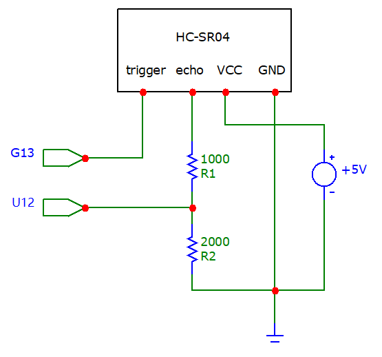
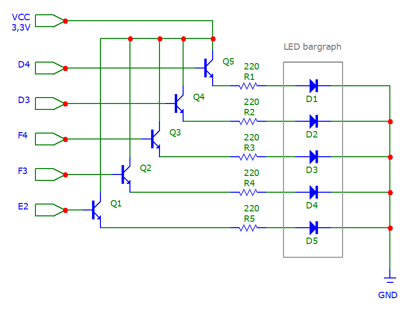
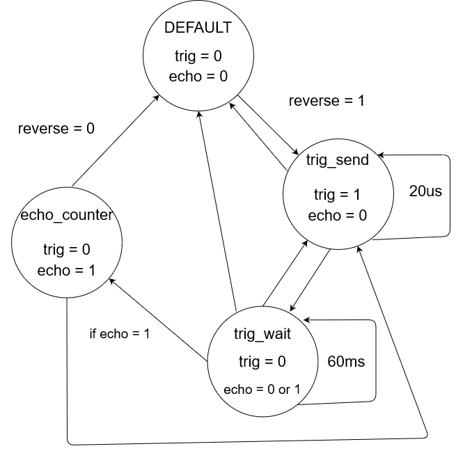

# Parking assistant with HC-SR04 ultrasonic sensor, sound signaling using PWM, signaling by LED bargraph

## Team members

* Maroš Bilek
* Radek Burian
* Matúš Burčo
* Bohumír Brhel
* Adrián Bujna

## Project objectives

#### Project goal is to implement parking assistant with HC-SR04 ultrasonic sensor and LED bargraph onto board Arty A7-35T. Pulse width modulation(PWM) is used for sound signaling and LED baragraph for light signaling.

[GitHub project folder](to-do)

## Hardware description

### Choosen Components
 - Arty A7-35T
 - HC-SR04 ultrasonic sensor
 - LED bargraph
 - Buzzer
 - 5x Resistor 220Ω
 - Resistor 1000Ω
 - Resistor 2000Ω
 - 6x Transistor NPN
 - Voltage Source +5V

### Datasheets of used components

- [HC-SR04](https://cdn.sparkfun.com/datasheets/Sensors/Proximity/HCSR04.pdf)
- [LED baragraph](https://docs.broadcom.com/doc/5965-6545E)
- [Buzzer](http://www.electronicoscaldas.com/datasheet/LTE12-Series.pdf)
- [Resisitor](https://docs-emea.rs-online.com/webdocs/0e29/0900766b80e29d33.pdf)
- [Transistor NPN](https://www.onsemi.com/pdf/datasheet/2n3903-d.pdf)

### Board **Arty A7-35T**


### Schematics

#### HC-SR04


#### Buzzer


#### LED baragraph


### Pmod Connectors


|| Pmod JA | Pmod JB | Pmod JC | Pmod JD |
| :-: | :-: | :-: | :-: | :-:|
| **Pmod Type** | **Standart** | **Hight-Speed** | **Hight-Speed** | **Standart** | 
| Pin 1  | G13 | E15 | U12 | D4 |
| Pin 2  | B11 | E16 | V12 | D3 |
| Pin 3  | A11 | D15 | V10 | F4 |
| Pin 4  | D12 | C15 | V11 | F3 |
| Pin 7  | D13 | J17 | U14 | E2 |
| Pin 8  | B18 | J18 | V14 | D2 |
| Pin 9  | A18 | K15 | T13 | H2 |
| Pin 10 | K16 | J15 | U13 | G2 |

#### Sensor HC-SR04 connection table
| **Sensor HC - SR04** | **Board - JA_pmod** |
| :-: | :-: | 
| Trig | PIN1 - G13 |
| Echo | PIN7 - D13 |
| VCC | PIN6 -  VCC |
| GND | PIN5 - GND |

#### Buzzer connection table
| **Buzzer** | **Board - JA_pmod** |
| :-: | :-: | 
| VCC | PIN12 - VCC |
| GND | PIN11 - GND |

#### LED bargraph connection table
| **LED bargraph** | **Board - JD_pmod** |
| :-: | :-: | 
| D1 | PIN1 - D4 |
| D2 | PIN2 - D3 |
| D3 | PIN3 -  F4 |
| D4 | PIN4 - F3 |
| D5 | PIN7 - E2 |
| GND | PIN5 - GND |
| VCC | PIN6 - VCC |


## VHDL modules description and simulations

### ```pwm.vhd```
This module is...

#### Design module code
```vhdl

```

#### Testbench code
```vhdl

```

#### Screenshot with simulated time waveforms


### ```clk.vhd```
This module is...

#### Design module code for ```clk100Mhz.vhd```
```vhdl

```

#### Testbench code for ```clk100Mhz.vhd```
```vhdl

```

#### Screenshot with simulated time waveforms for ```clk100Mhz.vhd```


#### Design module code for ```clk4khz.vhd```
```vhdl

```

#### Testbench code for ```clk4khz.vhd```
```vhdl

```

#### Screenshot with simulated time waveforms for ```clk4khz.vhd```


### ```state_machine.vhd```
This module is main function module implementing state machine...

#### State Diagram


#### Design module code
```vhdl

```

#### Testbench code
```vhdl

```

#### Screenshot with simulated time waveforms


### ```LED_baragraph.vhd```
This module is...

#### Table of LED light diodes
|  Rozsah[Cm]  |  LED  |
| :-: | :-: |
| 0 - 20 | 11111 | 
| 20 - 40 | 11110 |
| 40 - 60 | 11100 | 
| 60 - 80 | 11000 |
| 80 - 100 | 10000 |
| 100 < | 00000 |

#### Design module code
```vhdl

```

#### Testbench code
```vhdl

```

#### Screenshot with simulated time waveforms


## TOP module description and simulations
This module is used to implement all modules onto Arty A7-35T board...

### Schematic of TOP


### Design module code
```vhdl

```

### Testbench code
```vhdl

```

#### Screenshot with simulated time waveforms


## Video
- [Video for the presentation of the project]()

## References